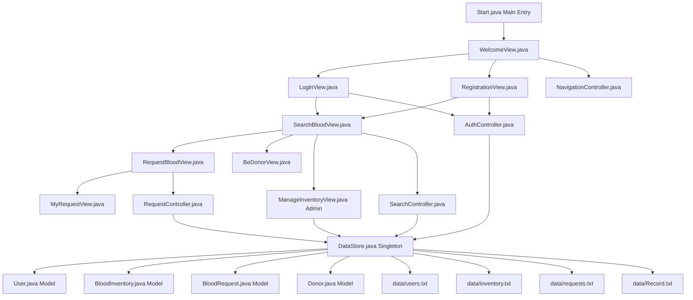

# System Architecture & Knowledge Graph

This document details the component architecture, data relationships, and workflow interactions for the **Blood Bank Management System (BBMS)**.

---

## 1. System Knowledge Graph (Mermaid Visualization)

---

## 2. Component Reference & Data Flow

### A. View Component Layer
- **`Start.java`**: Invokes `SwingUtilities.invokeLater()` to launch `WelcomeView`.
- **`WelcomeView`**: Landing screen providing initial pathways to Login and Registration.
- **`LoginView`**: User authentication screen validating credentials against `users.txt`.
- **`RegistrationView`**: Multi-role user creation (Patient, Donor, Admin/Staff).
- **`SearchBloodView`**: Main dashboard for querying available hospital inventory and registered donors list.
- **`BeDonorView`**: Donor registration form persisting to `data/Record.txt`.
- **`RequestBloodView`**: Form for submitting urgent patient blood requests.
- **`MyRequestView`**: Summary confirmation screen for submitted patient requests.
- **`ManageInventoryView`**: Admin dashboard for full CRUD operations (Stock management, request fulfillment, user management).

### B. Controller Layer
- **`AuthController`**: Handles account validation and authentication logic.
- **`NavigationController`**: Singleton managing window transitions and active user sessions.
- **`RequestController`**: Validates patient blood requests and generates request IDs.
- **`SearchController`**: Processes inventory filtering parameters.

### C. Data Persistence Layer (`data/`)
- **`data/users.txt`**: User accounts (`FullName;Email;Phone;BloodGroup;Username;Password;Role`)
- **`data/inventory.txt`**: Hospital stock (`BloodGroup;Location;HospitalName;DistanceKM;Bags`)
- **`data/requests.txt`**: Patient requests (`RequestId;PatientName;BloodGroup;Bags;Location;Hospital;Contact;Status`)
- **`data/Record.txt`**: Registered donor records (`Name\nAge\nSex\nEmail\nPhone\nAddress\nBloodGroup\n`)
